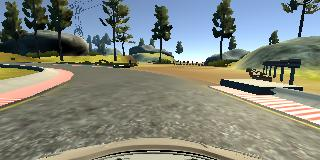
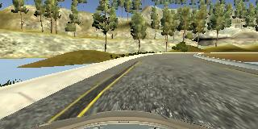
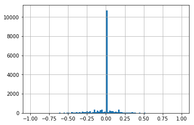
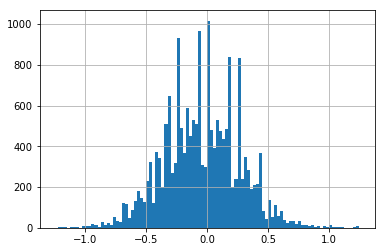

#**Behavioral Cloning** 

---

**Behavioral Cloning Project**

The goals / steps of this project are the following:
* Use the simulator to collect data of good driving behavior
* Build, a convolutional neural network in Keras that predicts steering angles from images
* Train and validate the model with a training and validation set
* Test that the model successfully drives around track one without leaving the road
* Summarize the results with a written report

## Rubric Points
###Here I will consider the [rubric points](https://review.udacity.com/#!/rubrics/432/view) individually and describe how I addressed each point in my implementation.  

---
###Files Submitted & Code Quality

#### 1. Submission includes all required files and can be used to run the simulator in autonomous mode

My project includes the following files:

* part1_compile_data.ipynb (notebook used to compile data from multiple training runs)
* model.py (notebook used to create and train the model)
* drive.py (script to drive the car)
* model.h5 (a trained Keras model)
* writeup.md (a writeup of my methodology)

#### 2. Submission includes functional code
Using the Udacity provided simulator and my drive.py file, the car can be driven autonomously around the track by executing 
```sh
python drive.py model.h5
```

#### 3. Submission code is usable and readable

The part1_complile_data.ipynb notebook has details on how I compile data from multiple training runs. The model.py file contains the code for training and saving the convolution neural network. The file shows the pipeline I used for training and validating the model, and it contains comments to explain how the code works.

### Model Architecture and Training Strategy

#### 1. An appropriate model architecture has been employed

My model consists of a convolution neural network with a combination of 5x5 and 3x3 layers followed by fully connected layers. (model.py lines 101-113). For further details on the architecture, please scroll down. The model includes `elu` layers to introduce nonlinearity , and the data is normalized in the model using a Keras lambda layer . 

####2. Attempts to reduce overfitting in the model

The model contains a dropout layer in order to reduce overfitting.

####3. Model parameter tuning

The model used an adam optimizer, so the learning rate was not tuned manually.

####4. Appropriate training data

Training data was chosen to keep the vehicle driving on the road. I used multiple runs of center lane driving, recovering from edges etc. The results were validated by testing on the simulator.

For details about how I created the training data, see the next section. 

### Model Architecture and Training Strategy

#### 1. Solution Design Approach

The overall strategy for deriving a model architecture was to use a convoloutional neural network given their ability to extract features from images. I split my dataset into a training and validation set to check for overfitting (the validation loss wasn't much higher than the training loss). I also stopped at 3 epochs to stop overfitting.

####2. Final Model Architecture

The final model architecture (model.py lines 18-24) consisted of a convolution neural network with the following layers and layer sizes 

* The first layer to normalize data, which takes a 66x200x3 RGB image
* A 5x5 Conv2D layer with a stride of 2 in both x and y direcations and `elu` activation. Depth = 24. 
* A 5x5 Conv2D layer with a stride of 2 in both x and y direcations and `elu` activation. Depth = 36. 
* A 5x5 Conv2D layer with a stride of 2 in both x and y direcations and `elu` activation. Depth = 48. 
* A 3x3 Conv2D layer with a stride of 1 in both x and y direcations and `elu` activation. Depth = 64. 
* A 3x3 Conv2D layer with a stride of 1 in both x and y direcations and `elu` activation. Depth = 64. 
* A dropout layer with a keep_prob of 0.5
* Fully connected layer with 100 neurons and `elu` activation
* Fully connected layer with 50 neurons and `elu` activation
* Fully connected layer with 10 neurons and `elu` activation
* Output layer with one neuron

####3. Creation of the Training Set & Training Process

I started off with a lot of center lane driving ..



Followed by some recovery data ..



I also used data from the left and right camera images. For the left camera, I added a 0.25 to the steering angle and for the right camera, I subtracted 0.25. I also randomly flipped the images (left --> right and vice versa) to create roughly the same number of data points for left and right turns.



I also realized that the steering angle was 0 for a large number of cases, so I sampled down on the 0 angle data points so that the training isn't overly influenced by straight driving.


